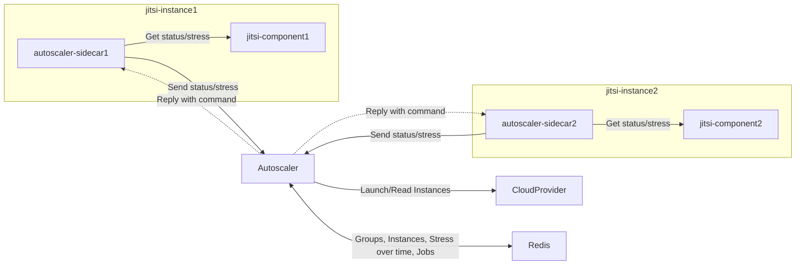
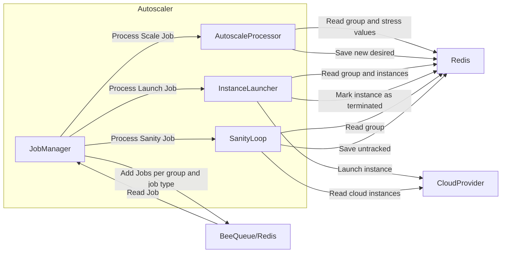

# jitsi-autoscaler

## Overview

### High Level

An autoscaler for Jitsi instances (`jibri`, `sip-jibri`, `jigasi`, `JVB`, `nomad`), which are deployed in one of the following ways:
* as an Instance in Oracle Cloud
* as a containerized parameterized nomad job
* as a Droplet in Digital Ocean
* custom deployment model

The autoscaler manages multiple `groups` of instances, each having a `type` (`jibri`, `sip-jibri`, `jigasi`, `JVB`, `nomad`) and being deployed in a specific `cloud` (`oracle`, `digitalocean`, `custom`).

The autoscaler knows the Jitsi instances status and communicates with them via the [jitsi-autoscaler-sidecar](https://github.com/jitsi/jitsi-autoscaler-sidecar),
which needs to be co-located on each Jitsi instance. The sidecar periodically checks in with the autoscaler via a REST call and sends its status. 
As a response of the check-in operation, the sidecar receives commands from the autoscaler, such as: terminate or reconfigure the Jitsi instance.



### Internal workings

For each `group`, the autoscaler periodically does the following processing:
* `Launch`: checks how many instances the group has and compares them with the group's `desired` count. Based on this, it will either launch new instances, or ask the sidecar of those instances to kill them
* `Autoscale`: checks the metrics which are periodically sent by the sidecar, and according to the group's `scalingOptions`, decides whether to increase or decrease the group's `desired` count
* `Sanity`: checks if the instances seen by the autoscaler via their sidecar match the ones found directly in the cloud provider



## Control Plane

The autoscaler exposes a REST API for CRUD operations over groups, as well as orchestrating specific behaviour for one or a set of groups.

For each `group` you can enable/disable types of behaviour via the following properties:
* `enableLaunch` - whether the `Launch` processing is enabled
* `enableAutoScale` - whether the `Autoscale` processing is enabled
* `enableScheduler` - whether a `full-scaling` update (see `PUT /groups/options/full-scaling`) will also update this group; this kind of update is usually done by an external scheduler, wanting to do bulk group scale up/down at a certain time
* `enableUntrackedThrottle` - whether launching new instances will happen only if there aren't too many untracked instances
* `enableReconfiguration` - whether the `reconfiguration` action is enabled (see `POST /groups/:name/actions/reconfigure-instances`)

Additionally, the autoscaler provides REST APIs for introspection covering:
* Group `report` - current status of the group (e.g. how many instances are available, how many are used etc.), together with the status of the instances managed by the group
* Group/Instance `Audit` - past actions of the group/instance, e.g. history of autoscaling decisions, history of launch/terminate operations etc

## Building
```
npm install
npm run build
```

You can find the build in `dist/`. There's only one bundled file there - `main.js`.

## Runnning

```
npm run build
npm run start
```

or after the build is done:

```
node dist/main.js
```

### Config.json

You must specify the path to a `groups.json` file as an environment variable. We read the groups for autoscaling from there.

## docker-compose

To run the demo docker-compose setup, all config must be added to the config/ directory.
The following commands may then be used:

### build the images
```
docker-compose -f demo/docker-compose.yml build
```

### start up the containers
```
docker-compose -f demo/docker-compose.yml up
```

### tear down the containers
```
docker-compose -f demo/docker-compose.yml down
```
